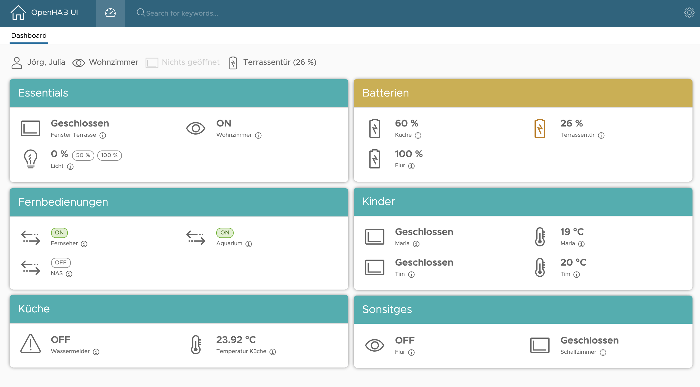

# Openhab UI

A simple and lean Angular UI for giving easy control and overview about your OpenHab Server. The tool operates using OpenHab REST API. I developed it for local usage in same network as OpenHab Server.

[[_TOC_]]

## Technology

---

- Angular 9
- RxJS
- UI: Clarity 3

### Supported Browsers

- Safari >= 13
- Chrome >= 80

## Setup

---

### OpenHab

* Pre-Requisite: Add the line `org.eclipse.smarthome.cors:enable=true` in the file *services/runtime.cfg*

### How to run the UI locally in dev mode

1. Install angular cli (`npm install -g @angular/cli`)
2. clone this git repo (`git clone https://github.com/jh1777/OpenHabUI.git`)
3. run `npm i` in cloned folder to install required packages
4. start app using `ng serve` or use provided script `start-on-server.sh` (takes care of host and customizes port to 4222)

## UI Components

---

The whole design is based on [Clarity UI](https://www.clarity.design).

### Dashboard

The dashboard is the main entrypoint when the UI is started. It ist also the main intention for which this UI was developed. 

It shows a configurable summary of items/groups you are interested in. If an item can be modified (e.g. switch, light) this is possible in the dashboard directly. This also applies to groups. The dashboard also provides a summary bar on top for a quick status overview.

Preview screenshot of a dashboard (including red marked UI components):



### Room Pages

tbd in later versions

## How to configure

---

**The `config.json` file is the main configuration of this App!** Everything what you want to see in the UI you need to configure there!

> An example `config.json` is contained in the repo. Please carefully take a look at that!

### Structure

```json
{
    "openHabUrl": "http://<ip>:<port>/rest",
    "itemStateHistory": 10,
    "showOnlyActivityInSummary": true,
    "dashboardTiles": [],
  	"rooms": []
}
```

**openHabUrl**: `openHabUrl`  is used to set the OpenHAB API URL of your OpenHab server.

The **OpenHab API URL** must be configured like `http://localhost:8080/rest` (for example). Please adapt according to your hostname and port.
> Don't forget to setup OpenHab like described above in Setup -> OpenHab section.

**itemStateHisory**: In the detail dialog you can see the past states of an item. How many can be set here. 10 is default. Please keep in mind that currently only the last 24 hrs are queried at maximum! Also this may have impact on the UI since it is not designed to view lage tables at this point.

**showOnlyActivityInSummary**: This impacts of items will be shown in summary header.

Example of **showOnlyActivityInSummary** = true (_no movement item currently triggered!_):


Example of **showOnlyActivityInSummary** = false (_no movement item currently triggered!_):


As you can see this also shows non-triggered items in the summary. You may modify the placeholder stings on your own in file `src/app/services/serviceTools/summaryTools.ts`. They are static by *category*.

### Understanding the `category`

---

As a **fundamental structural property**, the `category` of each item or group you define in `config.json` is responsible for its layout, icon, behavior and UI representation.

**The following categories are currently defined:**

- temperature
  - **Icon**: 
  - **Unit**: you may specify "°C" for example
  - **Editable**: No
  - **Usage**: temperature sensor
- contact
  - **Icon**: 
  - **Unit**: N/A
  - **Editable**: No
  - **Usage**: window / door sensor
- motion
  - **Icon**: 
  - **Unit**: N/A
  - **Editable**: No
  - **Usage**: motion sensor
- alert
  - **Icon**: 
  - **Unit**: N/A
  - **Editable**: No
  - **Usage**: water sensors or any other where ON is an alert 
- battery
  - **Icon**: 
  - **Unit**: you may specify "%" for example
  - **Editable**: No
  - **Usage**: battery sensor
- dimmer
  - **Icon**: 
  - **Unit**: you may specify "%" for example
  - **Editable**: Yes (UI: Buttons for 50% and 100%)
  - **Usage**: dimmable light
- switch
  - **Icon**: 
  - **Unit**: N/A
  - **Editable**: Yes (UI: ON / OFF switch)
  - **Usage**: switchable item
- sun
  - **Icon**: 
  - **Unit**: you may specify "%" or "lux" for example as your sensor reports
  - **Editable**: No
  - **Usage**: luminance sensor
- presence
  - **Icon**: 
  - **Unit**: N/A
  - **Editable**: No
  - **Usage**: presence sensor
- heating (TBD)
  - **Icon**: 
  - **Unit**: %
  - **Editable**: Yes
  - **Usage**: heating / thermostat
- rollershutter (TBD)
  - **Icon**: 
  - **Unit**: %
  - **Editable**: Yes
  - **Usage**: rollershutter

###  Section `dashboardTiles`

This section contains all _tile_ definitions for the dashboard! Each tile itself has a _title_ and some _items_ in it. You can define each item like you want it to be. 

Each single _item_ is defined as:

```json
{
    "name": "<openhab item or group name>", // mandatory and must exactly match openhab
    "displayName": "<label in UI>", // mandatory
    "category": "<category>", // mandatory, see documentation about possible categories
    "unit": "<item unit like °C, % etc.>", // optional
    "warningThreshold": 25, // optional: if set, state will be compared and set to isWarning (only for OH items, not groups)
    "warningThresholdType": "gt", // mandatory, if warningThreshold is set: this should be also set to 'gt' (greater or equal than) or 'lt' (lower or equal than) to be able to determine warning state (only for OH items, not groups)
    "showInSummary": true,  // optional: If you want to include this item in the summary bar (default is false)
    "showOnlyInSummary": false,  // optional: If you want to include this item ONLY in the summary bar and don't show in a tile (default is false)
  	"isGroup": true // optional: is this entry is an openhab group? (default = false)
}
```

### Section `rooms`

Define `groupName` and `displayName` of groups you want to see on a separate page in the UI. 
One page for each room will be shown. **This feature will be implemented later!**

## Tiles

---

The items configured in `config.json` section `dashboardTiles` will be parsed and each will be queried using OpenHab REST API GET request. This also applies for the groups. 

The way how the UI shows the data is different between groups and single items.

### Single Item

A **single item** is also one item in OpenHab. The category in config defines how this is shown because REST API gives no constant information about this across all manufactors etc. The only interesting values are `state` and if present also the `transformedState` which are taken from the API response.

The **label** of an item will be taken from the config without taking any OpenHab item properties into account. 

If it is a **numeric state** and in config there is a `warningThreshold` defined (desinged for Battery State) it will be compared against that threshold. You may also specify `warningThresholdType` if the direction to check is different. Anyway, by design this is currently a 0 - 100 scale.

If you specify a **unit**, this will be shown after the original state. So if you have battery state 56 and unit % the UI will concat both. This makes the UI somehow more flexible against custom item definitions for OpenHab.

### Group Item

...

## Summary Bar

---

### Single Item

The **summary** is a simple bar at the top of the dashboard to quickly get an overview. If the item should be shown there you may set `showInSummary` to true. The summary is grouped by category. All _item labels_ with same `category` will be concatenated (using , <comma>) in the summary bar. 

There is a defined state for each `category` that is used to determine when a certain item is "triggered". By default only triggered items are shown. Please refer to config.json documentation in this file!

**Example**: If you have 3 windows with labels "John", "Mike", "Tom". Now only windows of Tom and Mike are OPEN, which is the "triggered"-state for `category` = contact, the summary will show:  Tom, Mike

...

### Group Item

...


## Reference

### Repo Link

[GitHub Repo](https://github.com/jh1777/OpenHabUI)

### Useful Tutorial for Clarity

https://medium.com/@beeman/tutorial-project-clarity-and-angular-cli-50d845a24d5b

### CShap Linq vs Typescript

https://decembersoft.com/posts/typescript-vs-csharp-linq/

### Clarity

https://clarity.design/documentation

https://dzone.com/articles/how-to-use-change-detection-in-angular