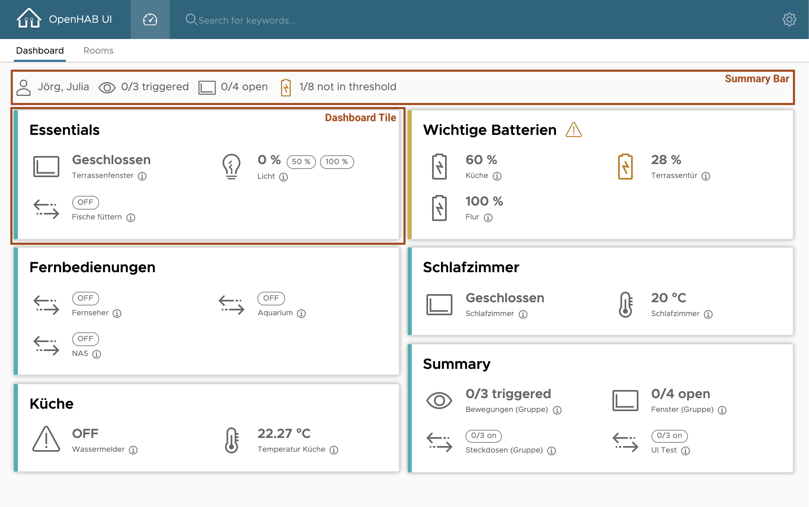

# Openhab UI

A smart and lean Angular UI for your OpenHab Server (locally) using OpenHab REST API.

[[_TOC_]]

## Setup

### Supported Browsers

- Safari >= 13
- Chrome >= 80

### OpenHab

**TODO:** Add the line `org.eclipse.smarthome.cors:enable=true` in the file *services/runtime.cfg*

### Run locally in dev mode

1. Install angular cli (`npm install -g @angular/cli`)
2. clone this git repo (`git clone https://github.com/jh1777/OpenHabUI.git`)
3. run `npm i` in cloned folder
4. start app using `ng serve` or use provided script `start-on-server.sh` (takes care of host and customizes port to 4222)

## Components

The UI has basically two parts, one dashboard page and room pages (depending on config).

The whole design is based on [Clarity UI](https://www.clarity.design).

### Dashboard

---

The dashboard is the main entrypoint when the UI is started

This shows a configurable summary overview of all items you want to see there. If they can be modified this is also possible in the dashboard directly. The dashboard also provides a summary bar on top for a quick status overview.

Preview screenshot of a dashboard:



### Room Pages

tbd

## How to configure

**The `config.json` file is the main configuration of this App!**

### URL

---

`openHabUrl`key is used to set the OpenHAB API URL.

The **OpenHab API URL** must be configured like `http://localhost:8080/rest` (for example). Please adapt according to your hostname and port.
> Don't forget to setup OpenHab like described above in Setup -> OpenHab section.

### Understanding the `category`

---

As a fundamental structural property, the `category` of each item you define in config is responsible for its layout, icon and UI representation.

Teh following categories are defined:

- temperature
  - **Icon**: 
  - **Unit**: you may specify "°C" for example
  - **Editable**: No
  - **Usage**: temperature sensor
- contact
  - **Icon**: 
  - **Unit**: N/A
  - **Editable**: No
  - **Usage**: window / door sensor
- motion
  - **Icon**: 
  - **Unit**: N/A
  - **Editable**: No
  - **Usage**: motion sensor
- alert
  - **Icon**: 
  - **Unit**: N/A
  - **Editable**: No
  - **Usage**: water sensors or any other where ON is an alert 
- battery
  - **Icon**: 
  - **Unit**: you may specify "%" for example
  - **Editable**: No
  - **Usage**: battery sensor
- dimmer
  - **Icon**: 
  - **Unit**: you may specify "%" for example
  - **Editable**: Yes (UI: Buttons for 50% and 100%)
  - **Usage**: dimmable light
- switch
  - **Icon**: 
  - **Unit**: N/A
  - **Editable**: Yes (UI: ON / OFF switch)
  - **Usage**: switchable item
- sun
  - **Icon**: 
  - **Unit**: you may specify "%" or "lux" for example as your sensor reports
  - **Editable**: No
  - **Usage**: luminance sensor
- presence
  - **Icon**: 
  - **Unit**: N/A
  - **Editable**: No
  - **Usage**: presence sensor

### `config.json` Sections

---

There are three main sections in `config.json`.

#### dashboardTiles

This section contains all _tile_ definitions for the dashboard. Each tile itself has a _title_ and some _items_ in it. You can define each item like you want it to be. 

Each single _item_ is defined as:

```json
{
    "name": "<openhab item name>",
    "displayName": "<label in UI>",
    "category": "<category - see below>",
    "unit": "<item unit like °C, % etc.>", // optional
    "warningThreshold": 25, // optional: if set, state will be compared and set to isWarning
    "warningThresholdType": "gt", // optional: if warningThreshold is set, this should be also set to 'gt' (greater than) or 'lt' (lower than) to be able to determine warning state
    "showInSummary": true,  // optional: If you want to include this item in the summary bar (default is false)
    "showOnlyInSummary": false  // optional: If you want to include this item ONLY in the summary bar and don't show in a tile (default is false)
}
```

#### rooms

Define `groupName` and `displayName` of groups you want to see on a separate page in the UI. 
One page for each room will be shown.

## Reference

### Repo Link

[GitHub Repo](https://github.com/jh1777/OpenHabUI)

### Useful Tutorial for Clarity

https://medium.com/@beeman/tutorial-project-clarity-and-angular-cli-50d845a24d5b

### CShap Linq vs Typescript

https://decembersoft.com/posts/typescript-vs-csharp-linq/

### Clarity

https://clarity.design/documentation
